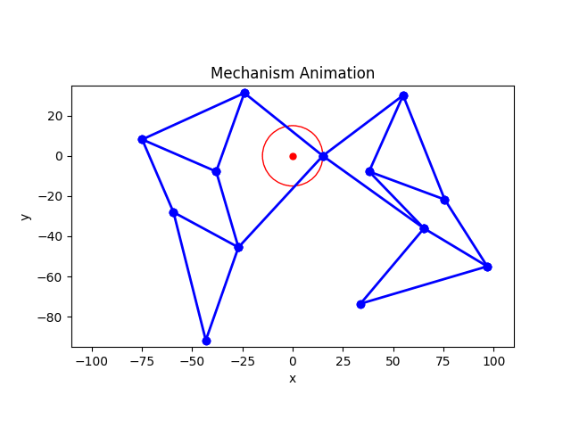

# BA-SWD-Abschlussprojekt

## Mechanism Simulator
This Streamlit application creates simulations of mechanical mechanism that consists of joints and rods. Users can configurate their own mechanism or select predefined mechanism.

### Implemented Features
- Streamlit Web-UI with two tabs:
    - Config (create your own mechanism)
    - Visualization (visualize selected mechanism)
- Positions-kinematics will be calculated from 0° to 360°
- Validation of mechanism
- Save and download mechanism configuration (JSON-file)
- Animation can be saved and downloaded (GIF-file)
- Create and download a frame at a chosen angle (PNG-file)
- Export of joint coordinates for all angles at choosen resolution (CSV-file)
- Drag and Drop field to upload configurations
- Leaderboard (shows rendering times of PC's)
- The following predefined configurations are available
    - Strandbeest-Leg
    - Double Strandbeest-Leg
    - Viergelenkkette

### Link to Streamlit application
Link: [Mechanism Simulator](https://mechanism-simulator.streamlit.app/)

### Animation of Strandbeest-Leg

  

