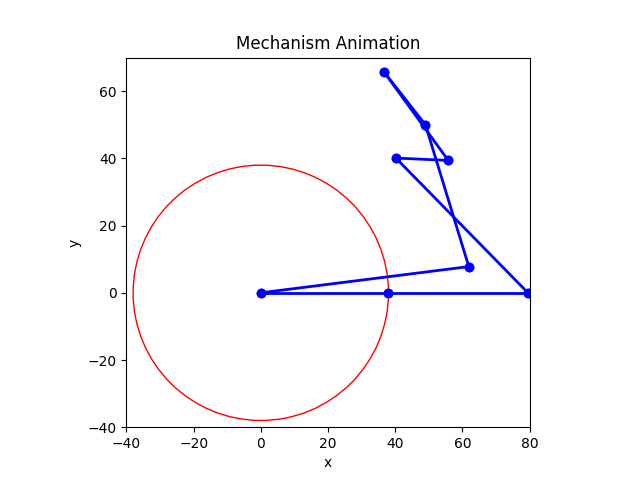

# BA-SWD-Abschlussprojekt

## Mechanism Simulator
This Streamlit application creates simulations of mechanical mechanism that consists of joints and rods. Users can configurate their own mechanism or select predefined mechanism.

### Implemented Features
- Streamlit Web-UI with two tabs:
    - configuration (create your own mechanism)
    - animation (visualize selected mechanism)
- Positions-kinematics will be calculated from 0° to 360°
- Validation of mechanism
- Save mechanism configuration (JSON-file)
- Animation can be saved (GIF-file)
- Create and download a frame at a chosen angle (PNG-file)
- Export of joint coordinates for all angles (CSV-file)
- Drag and Drop field to upload configurations
- The following predefined configurations are available
    - Strandbeest-Leg
    - Double Strandbeest-Leg
    - Viergelenkkette
    - Invalid configuration (to show error at validation)

### Link to Streamlit application
Link: still has to be deployed

### Animation of Strandbeest-Leg

  
</p